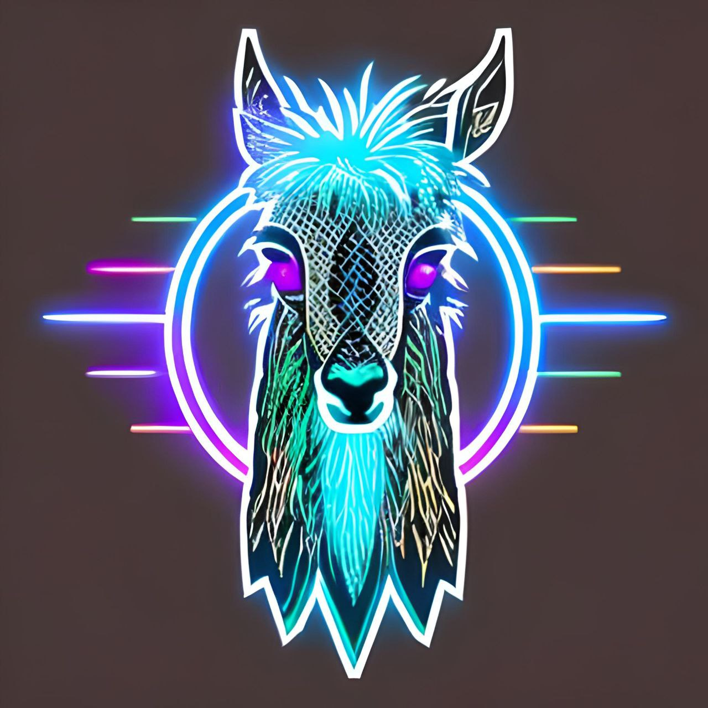

# D-LAMA WebApp

The _D-LAMA WebApp_ is the Front-End of the D-LAMA Application. It uses the JavaScript framework React and the component library Ionic.

<div style="display:flex;align-items:center;justify-content:center;">

</div>

## Installation

### Prerequisites

- Node.js (v14 or later)
- npm (v6 or later)

1. Clone this repository to your local machine or download the source code.
2. Navigate to the project directory.
3. Install the dependencies.

```shell
npm install
```

## Development

To start the development server, run the following command:

```shell
npm run dev
```

### Project setup

- **public**: The static page and its assets for the first load
- **src**: The React application
  - components: In this folder there are components which can be re-used everywhere in the project.
  - helper: In this folder there are helper functions.
  - hooks: In this folder there are custom hooks which can be used everywhere in the project such as data fetching.
  - pages: In this folder every view has its own folder which then can have their separate components.
  - store: This folder contains the store functions of react query which can be used everywhere in the project.
  - theme: This folder contains the global stylesheets.

### Coding guidelines

- Generally, the project was built according to the SOLID principle.
- Naming convention
  - Components are written in CamelCase notation with the first letter in upper case `LoginDesktop`
  - Functions are written in CamelCase notation with the first letter in lower case `handleChange()`
  - Variables are written in CamelCase notation with the first letter in lower case `let projectName`
  - Folders are written in CamelCase notation with the first letter in lower case `/src/pages/projectOverview`

### Branching workflow

Feature branch (feat/...) or fix branch (fix/...) is merged directly into the main branch. This ensures an efficient deployment and allows a fast response to customer / team feedback.

### Developers

- [Schazad Mohammad](https://github.com/schazadm)
- [Rebekka von Wartburg](https://github.com/vonwareb)
- [Noah Lichtenecker](https://github.com/noegeler)
